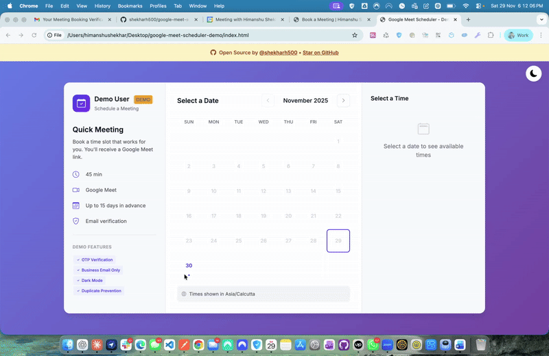

# Google Meet Scheduler

A free, open-source meeting scheduler with Google Calendar integration.



---

## Try the Demo First

Open `index.html` in your browser - no setup needed!

- Use any email to test
- Enter OTP: **`123456`** (fake OTP for demo)
- See how the scheduler works before deploying

---

## Project Structure

```
google-meet-scheduler-demo/
├── index.html              ← DEMO (try this first, works offline)
├── frontend/
│   └── index.html          ← PRODUCTION (deploy this)
├── backend/
│   ├── server.js           ← API server (deploy to Vercel)
│   ├── .env.example        ← Environment variables template
│   └── vercel.json         ← Vercel config
└── README.md
```

---

## What You Need to Change

### Backend: 5 Environment Variables (Vercel Dashboard)

| Variable | What to Put | Where to Get It |
|----------|-------------|-----------------|
| `GOOGLE_CLIENT_ID` | `xxx.apps.googleusercontent.com` | Google Cloud Console |
| `GOOGLE_CLIENT_SECRET` | `GOCSPX-xxx` | Google Cloud Console |
| `OWNER_EMAIL` | `you@yourcompany.com` | Your email |
| `OWNER_NAME` | `Your Name` | Your name |
| `FRONTEND_URL` | `https://yourusername.github.io` | Your deployed frontend URL |

### Frontend: 5 Lines to Edit (`frontend/index.html`)

| Line | Current Value | Change To |
|------|--------------|-----------|
| **21** | `<title>Schedule a Meeting</title>` | Your page title |
| **405** | `<span>Schedule a Meeting</span>` | Your subtitle |
| **410** | `<h2>Consultation</h2>` | Your meeting type |
| **412** | `<p>Book a time slot...</p>` | Your description |
| **548** | `const API_BASE = 'http://localhost:3000'` | Your Vercel backend URL |

**Tip:** Search for `CHANGE:` in the file to find all editable parts.

### Backend: Customize Schedule (`backend/server.js`)

| Line | Setting | Default | Your Value |
|------|---------|---------|------------|
| **28** | `maxDaysInAdvance` | `15` | How many days ahead |
| **29** | `minHoursNotice` | `4` | Minimum hours notice |
| **30** | `meetingDuration` | `45` | Meeting length (minutes) |
| **32** | `timezone` | `'Asia/Kolkata'` | Your timezone |
| **37-45** | `WORKING_HOURS` | 9 AM - 5 PM | Your available hours |

---

## Deployment Guide (20 minutes)

### Step 1: Get Google Credentials (10 min)

1. Go to [Google Cloud Console](https://console.cloud.google.com/)
2. Create new project → Name it "Meeting Scheduler"
3. **Enable APIs:**
   - Search "Google Calendar API" → Enable
   - Search "Gmail API" → Enable
4. **OAuth Consent Screen:**
   - Go to APIs & Services → OAuth consent screen
   - Select "External" → Create
   - Fill: App name, User support email, Developer email
   - Click Save → Continue through all steps
5. **Create Credentials:**
   - Go to APIs & Services → Credentials
   - Click "+ Create Credentials" → OAuth client ID
   - Application type: Web application
   - Add Authorized redirect URI: `http://localhost:3000/auth/callback`
   - Click Create
   - **Save your Client ID and Client Secret!**

### Step 2: Deploy Backend to Vercel (5 min)

Open Terminal and navigate to the backend folder:

```bash
# If you downloaded/cloned to Downloads folder:
cd ~/Downloads/google-meet-scheduler-demo/backend

# Or if you're already in the project folder:
cd backend
```

Then deploy:

```bash
npm install -g vercel
vercel login
vercel
```

After deployment, add environment variables in **Vercel Dashboard → Settings → Environment Variables**:

```
GOOGLE_CLIENT_ID = your_client_id
GOOGLE_CLIENT_SECRET = your_client_secret
REDIRECT_URI = https://your-backend.vercel.app/auth/callback
OWNER_EMAIL = your@email.com
OWNER_NAME = Your Name
```

**Add your Vercel URL to Google Cloud:**
- Go to Google Cloud → Credentials → Your OAuth client
- Add redirect URI: `https://your-backend.vercel.app/auth/callback`

---

### Step 3: Connect Google Calendar (REQUIRED!)

⚠️ **Without this step, your scheduler won't work (401 error)**

1. Visit: `https://your-backend.vercel.app/auth/setup`
2. Sign in with Google and grant permissions
3. You'll see a success page with a JSON token
4. **Copy the entire token** (including `{` and `}`)
5. Go to Vercel Dashboard → Your backend project → Settings → Environment Variables
6. Add new variable: `GOOGLE_TOKENS` = paste the token
7. Click **Save**
8. Go to Deployments → Click ⋮ → **Redeploy**

---

### Step 4: Deploy Frontend to GitHub Pages (5 min)

1. Edit `frontend/index.html`:
   - Line 548: Change `API_BASE` to your backend URL
   - Customize text (lines 21, 405, 410, 412) - optional

2. Deploy to GitHub Pages:
   - Create a new GitHub repository
   - Upload `frontend/index.html` (rename to `index.html` in repo root)
   - Go to Settings → Pages → Source: Deploy from branch → `main` → Save
   - Your URL will be: `https://yourusername.github.io/repo-name`

3. **Important:** Add `FRONTEND_URL` to backend:
   - Vercel Dashboard → Backend project → Settings → Environment Variables
   - Add: `FRONTEND_URL` = `https://yourusername.github.io/repo-name`
   - Redeploy backend

**Done!** Your scheduler is live.

---

## Common Timezones

| Region | Timezone Code |
|--------|---------------|
| India | `Asia/Kolkata` |
| US East | `America/New_York` |
| US West | `America/Los_Angeles` |
| UK | `Europe/London` |
| Germany | `Europe/Berlin` |
| Australia | `Australia/Sydney` |
| Japan | `Asia/Tokyo` |
| Singapore | `Asia/Singapore` |

---

## Troubleshooting

### CORS Error (Most Common!)

If you see "blocked by CORS policy":

1. Go to Vercel Dashboard → Backend project → Settings → Environment Variables
2. Add: `FRONTEND_URL` = your exact frontend URL (e.g., `https://yourusername.github.io`)
3. Save and Redeploy

### 401 Unauthorized Error

If you see `401 Unauthorized` or `net::ERR_FAILED 401`:

1. Your Google Calendar is **not connected**
2. Visit: `https://your-backend.vercel.app/auth/setup`
3. Sign in with Google
4. Copy the token shown
5. Add to Vercel: `GOOGLE_TOKENS` = paste token
6. Add to Vercel: `FRONTEND_URL` = your frontend URL
7. Redeploy backend

### 404 Not Found on /auth/setup

If you see `404: NOT_FOUND` when visiting `/auth/setup`:

1. You deployed the **wrong folder**
2. Navigate to the backend folder and redeploy:
   ```bash
   # Use the full path to your backend folder
   cd ~/Downloads/google-meet-scheduler-demo/backend

   # Or drag the backend folder into Terminal, then:
   vercel --prod
   ```
3. Check Vercel Dashboard → Deployments for build errors

**Tip for Mac users:** You can drag the `backend` folder into Terminal to get the full path automatically.

### Other Issues

| Problem | Solution |
|---------|----------|
| "Calendar not connected" | Visit `/auth/setup` on your backend URL |
| "redirect_uri_mismatch" | URI in Google Cloud must match Vercel exactly |
| No dates clickable | Check `WORKING_HOURS` in server.js |
| OTP not arriving | Check spam folder, verify Gmail API is enabled |

---

## Allow Personal Emails (Gmail, Yahoo)

By default, only business emails are allowed. To allow all emails:

1. Open `backend/server.js`
2. Find `BLOCKED_PUBLIC_DOMAINS` (around line 248)
3. Comment out the domain check in `/api/send-otp` route
4. Redeploy: `vercel --prod`

---

## Disable OTP Verification

If you don't need email verification, you can skip OTP entirely:

### Frontend Changes (`frontend/index.html`):

Find the `validateEmail` function (around line 853) and replace with:

```javascript
function validateEmail() {
    const email = document.getElementById('email').value.trim().toLowerCase();
    if (email.includes('@') && email.includes('.')) {
        isEmailVerified = true;  // Auto-verify
        verifiedEmail = email;
        document.getElementById('sendOtpBtn').style.display = 'none';
        document.getElementById('emailVerified').classList.add('show');
        updateSubmitButton();
        return true;
    }
    return false;
}
```

Also hide the OTP hint - find line ~482 and change:
```html
<!-- Change this line -->
<div class="field-hint">Business email required (no Gmail, Yahoo, etc.)</div>

<!-- To this -->
<div class="field-hint">Enter your email address</div>
```

### Backend Changes (`backend/server.js`):

In the `/api/book` route (around line 577), remove or comment out the OTP verification check.

After changes, redeploy both frontend and backend.

---

## Need Help?

Open an issue on [GitHub](https://github.com/shekharh500/google-meet-scheduler-demo/issues)
