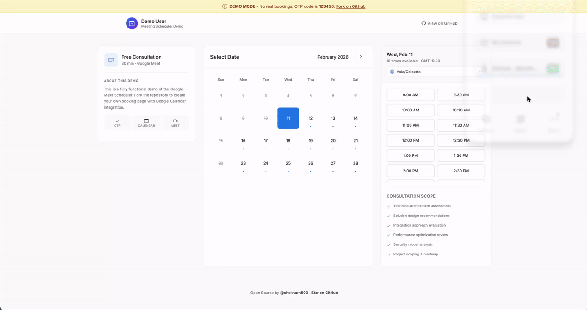

# Google Meet Scheduler

**Open-source meeting scheduler with Google Calendar integration. Deploy your own booking page in 20 minutes.**



## Features

| Feature | Description |
|---------|-------------|
| **Auto Google Meet Links** | Every booking automatically generates a unique Meet link |
| **Real-time Availability** | Displays only available slots from your Google Calendar |
| **Email Verification** | OTP-based verification prevents spam bookings |
| **Calendar Invites** | Sends `.ics` files to both host and attendee |
| **Business Email Filter** | Optional blocking of personal emails (Gmail, Yahoo, etc.) |
| **Timezone Support** | Automatically detects and handles visitor timezones |
| **Mobile Responsive** | Works seamlessly on all devices |
| **No Database Required** | Uses Google Calendar as the backend |

## Tech Stack

- **Frontend:** HTML, CSS, JavaScript (no framework)
- **Backend:** Node.js + Express
- **Hosting:** Vercel (serverless)
- **APIs:** Google Calendar, Gmail
- **Auth:** OAuth 2.0

---

## Try the Demo

Open `index.html` in your browser—no setup required.

- Use any email to test the flow
- Demo OTP: **`123456`**
- Explore the full scheduling experience before deploying

---

## Project Structure

```
google-meet-scheduler-demo/
├── index.html              # Demo version (try first, works offline)
├── frontend/
│   └── index.html          # Production version (deploy this)
├── backend/
│   ├── server.js           # API server
│   ├── .env.example        # Environment template
│   └── vercel.json         # Vercel config
└── README.md
```

---

## Configuration

### Backend Environment Variables

| Variable | Description |
|----------|-------------|
| `GOOGLE_CLIENT_ID` | OAuth client ID from Google Cloud |
| `GOOGLE_CLIENT_SECRET` | OAuth client secret |
| `OWNER_EMAIL` | Your email address |
| `OWNER_NAME` | Your display name |
| `FRONTEND_URL` | Deployed frontend URL |

### Frontend Customization

Edit `frontend/index.html` and search for `CHANGE:` to find all customizable sections:
- Page title and subtitle
- Meeting type and description
- Backend API URL (line 548)

### Backend Customization (`backend/server.js`)

| Setting | Default | Description |
|---------|---------|-------------|
| `maxDaysInAdvance` | 15 | Days ahead for booking |
| `minHoursNotice` | 4 | Minimum hours notice |
| `meetingDuration` | 45 | Meeting length (minutes) |
| `timezone` | `Asia/Kolkata` | Your timezone |
| `WORKING_HOURS` | 9 AM - 5 PM | Available hours |

---

## Deployment Guide

### Step 1: Google Cloud Setup

1. Create a project at [Google Cloud Console](https://console.cloud.google.com/)
2. Enable **Google Calendar API** and **Gmail API**
3. Configure OAuth consent screen (External, fill required fields)
4. Create OAuth credentials (Web application)
5. Add redirect URI: `http://localhost:3000/auth/callback`
6. Save your Client ID and Client Secret

### Step 2: Deploy Backend to Vercel

1. Fork this repository
2. Go to [vercel.com](https://vercel.com) → Add New Project
3. Import your fork, set **Root Directory** to `backend`
4. Deploy and copy your backend URL
5. Add environment variables in Settings:
   - `GOOGLE_CLIENT_ID`
   - `GOOGLE_CLIENT_SECRET`
   - `REDIRECT_URI` (your backend URL + `/auth/callback`)
   - `OWNER_EMAIL`
   - `OWNER_NAME`
6. Redeploy after adding variables
7. Add the Vercel callback URL to Google Cloud credentials

### Step 3: Connect Google Calendar

1. Visit `https://YOUR-BACKEND-URL/auth/setup`
2. Sign in and grant permissions
3. Copy the token displayed
4. Add `GOOGLE_TOKENS` to Vercel environment variables
5. Redeploy

### Step 4: Deploy Frontend

1. Edit `frontend/index.html` line 548 with your backend URL
2. In Vercel, create new project from same repo
3. Set **Root Directory** to `frontend`
4. Deploy
5. Add `FRONTEND_URL` to backend environment variables
6. Redeploy backend

---

## Troubleshooting

| Issue | Solution |
|-------|----------|
| CORS error | Add `FRONTEND_URL` to backend environment variables |
| 401 Unauthorized | Connect Google Calendar via `/auth/setup` |
| 404 on /auth/setup | Set Root Directory to `backend` in Vercel |
| redirect_uri_mismatch | Ensure URI in Google Cloud matches Vercel exactly |
| No dates clickable | Check `WORKING_HOURS` in server.js |
| OTP not arriving | Check spam folder, verify Gmail API is enabled |

---

## Common Timezones

| Region | Code |
|--------|------|
| India | `Asia/Kolkata` |
| US East | `America/New_York` |
| US West | `America/Los_Angeles` |
| UK | `Europe/London` |
| Germany | `Europe/Berlin` |
| Australia | `Australia/Sydney` |
| Japan | `Asia/Tokyo` |
| Singapore | `Asia/Singapore` |

---

## Customization Options

### Allow Personal Emails

Edit `backend/server.js`, find `BLOCKED_PUBLIC_DOMAINS`, and comment out the domain check in `/api/send-otp`.

### Disable OTP Verification

In `frontend/index.html`, modify `validateEmail` function to auto-verify emails. See inline comments for details.

---

## License

MIT License—free for personal and commercial use.

---

## Support

Open an issue on [GitHub](https://github.com/shekharh500/google-meet-scheduler-demo/issues)

